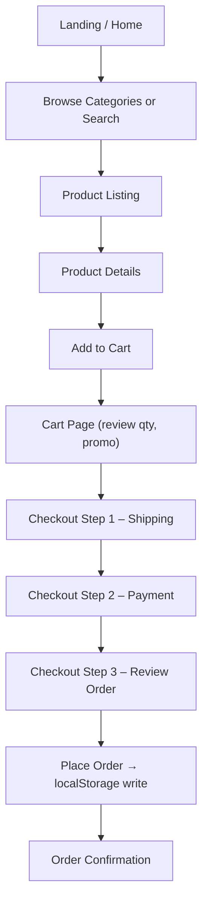

## 1. Product Overview
A fully client-side Amazon-style e-commerce clone built for demonstration purposes. No server dependencies, no external APIs - entirely self-contained with mock data, localStorage persistence, and offline capability.
- Primary purpose: Showcase a production-grade e-commerce UI/UX with full shopping flow (browse → search → filter → cart → checkout) that runs entirely in the browser without any external backend or Trae-specific services.
- Target users: Developers evaluating frontend architecture, demo portfolios, and anyone wanting a fully runnable e-commerce template.

## 2. Core Features

### 2.1 User Roles (if applicable)
| Role | Registration Method | Core Permissions |
|------|---------------------|------------------|
| Guest User | Implicit (no login required) | Browse products, search/filter, manage cart, complete mock checkout |
| Registered User | Client-side form (stored in localStorage) | Same as guest + saved addresses, order history |

### 2.2 Feature Module
1. **Home page**: Amazon-style header with search & cart, hero carousel, category cards, deal-of-the-day, product grid, footer
2. **Product Details page**: Image gallery, price/stock, product info, reviews, related products, add-to-cart
3. **Search Results page**: Search bar with filters (category, price range, rating), sort controls, product grid
4. **Category Browse page**: Category-specific hero, sub-category filter, product listing
5. **Shopping Cart page**: Line items with qty controls, price subtotal, promo code, proceed-to-checkout
6. **Checkout page**: Multi-step form (shipping → payment → review → confirmation), all client-side validated
7. **Order Confirmation page**: Success state, order summary, receipt mockup

### 2.3 Page Details
| Page Name | Module Name | Feature description |
|-----------|-------------|---------------------|
| Home page | Header | Logo, search bar with suggestions dropdown, account menu, cart counter with badge |
| Home page | Nav Bar | Horizontal category links with hover state |
| Home page | Hero Carousel | Auto-rotating promo banners with prev/next controls, dot indicators |
| Home page | Category Cards | 4-up grid of clickable category tiles with images |
| Home page | Deal of the Day | Countdown timer, featured product card, discount highlight |
| Home page | Product Grid | Paginated product cards across rows (Bestsellers, New Arrivals, etc.) |
| Home page | Footer | 4-column link list, region selector, copyright |
| Product Details | Media Gallery | Main image + thumbnail strip, hover zoom effect |
| Product Details | Buy Box | Price, strike-through, rating stars, stock badge, qty selector, Add to Cart / Buy Now |
| Product Details | Tabs | Description, Specifications, Customer Reviews (with star bar chart) |
| Product Details | Related Products | Horizontal scroll strip of related category items |
| Search Results | Filters Sidebar | Category tree, price range slider, rating filter, Prime-only toggle |
| Search Results | Sort Bar | Relevance / Price / Rating / Newest dropdown, result count |
| Cart Page | Items List | Per-item thumbnail, title, qty +/- , remove, price subtotal |
| Cart Page | Summary Sidebar | Items subtotal, shipping estimate, tax estimate, promo input, total, checkout CTA |
| Checkout | Step Indicator | 4-step progress bar (Shipping → Payment → Review → Place) |
| Checkout | Forms | Validated inputs (address, card with Luhn check, email), saved address selector |
| Order Confirmation | Success Banner | Animated checkmark, order ID, estimated delivery, receipt breakdown |

## 3. Core Process
Guest lands on home page, browses categories or searches. Clicking a product opens details. User adds one or more products to cart (badge updates). User navigates to cart to review quantities, then proceeds to checkout. Fills in shipping and payment details (all validated client-side), reviews, then places order → confirmation page with mock order ID and receipt. Cart is persisted in localStorage across sessions.

## 4. User Interface Design
### 4.1 Design Style
- **Primary color**: Amazon-inspired orange `#FF9900` as accent, deep navy `#131921` for top header, teal `#37475A` for sub-header
- **Secondary accents**: `#FFD814` (buy button yellow), `#007185` (link blue)
- **Buttons**: Slightly rounded (radius 6-10px), subtle 3D gradient on CTA buttons, hover shadow lift
- **Fonts**: Body uses clean serif for headings ("Playfair Display") paired with modern sans-serif ("Inter") for body – deliberately avoids generic-only system fonts
- **Layout**: Card-based product grid, sticky header, 2-column (filters + results) on search, 2-column (items + summary) on cart, single column on checkout
- **Icons/emoji**: Lucide icons throughout, star ratings use lucide `Star` filled/half/empty

### 4.2 Page Design Overview
| Page Name | Module Name | UI Elements |
|-----------|-------------|-------------|
| Home page | Header | Dark navy background, white search input, orange focus ring, cart badge |
| Home page | Hero Carousel | Gradient fade transitions, 5s auto-advance, smooth sliding animation |
| Home page | Category Cards | White cards with slight elevation lift on hover, category imagery, underlined link |
| Home page | Deal of the Day | Crimson red accent badge, live countdown timer, percentage badge |
| Product Details | Media Gallery | Sticky left column, thumbnail strip with active border, zoom lens on hover |
| Product Details | Buy Box | Sticky right column, yellow "Add to Cart", orange "Buy Now", stock warning |
| Cart Page | Items | Zebra-striped rows, compact remove button, smooth qty +/- transitions |
| Checkout | Step Indicator | Filled orange circles for completed, pale for upcoming, connector lines |

### 4.3 Responsiveness
- Desktop-first approach; breakpoints at `lg` (1024px), `md` (768px), `sm` (640px)
- Below md: sidebar filters collapse into modal, 1-column checkout, header search moves to full-width row below nav
- Touch targets ≥ 44px for buttons on mobile
- Product grid: 4-col desktop → 3-col md → 2-col sm → 1-col xs

### 4.4 3D Scene Guidance (if applicable)
N/A – this is a 2D e-commerce UI.
