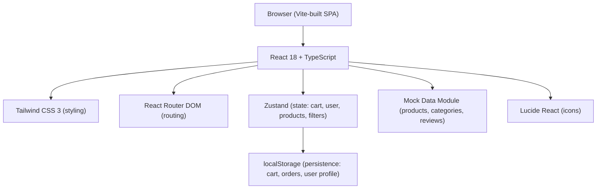
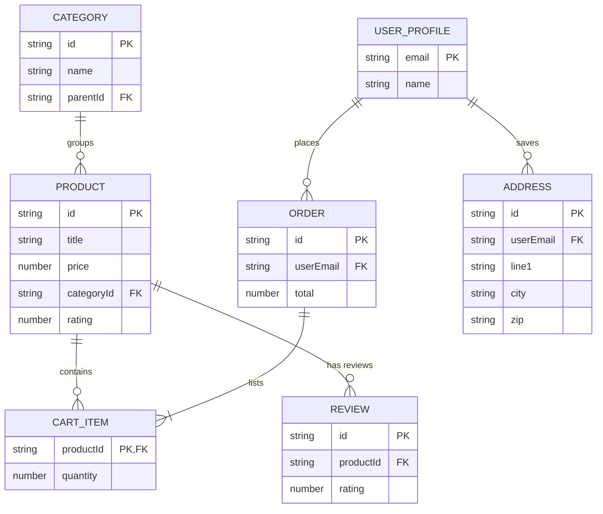

## 1. Architecture Design
Pure client-side (frontend-only) SPA. All persistence via browser localStorage. No backend, no external API calls, no Trae MCP dependencies at runtime. 100% self-contained and offline-capable once built.



## 2. Technology Description
- **Frontend**: React 18 + TypeScript + Tailwind CSS 3 + Vite
- **Routing**: react-router-dom v6 (client-side)
- **State management**: zustand (4 stores: products, cart, user, ui/filters)
- **Icons**: lucide-react (no inline SVG, no image-gen APIs)
- **Persistence**: browser localStorage (cart items, auth token, order history, profile)
- **Product images**: Uses deterministic Unsplash source URLs and Picsum Photos – free, CDN-hosted, no API keys needed. Fallbacks to CSS gradient placeholders if network unavailable.
- **Backend**: None (all logic client-side, localStorage-backed)
- **Database**: None (mock data as static TS arrays; orders saved to localStorage)
- **Initialization**: Vite `react-ts` template via vite-init

Key "Trae independent" design choices:
- No Supabase/Stripe or any external service integrations
- No calls to Trae MCP image generation APIs at runtime
- No MCP server interactions required to operate the app
- Build output is a pure static bundle (dist/) that can be hosted on any static host

## 3. Route Definitions
| Route | Purpose |
|-------|---------|
| / | Home page – hero, categories, deals, product sections |
| /category/:categoryId | Category browse page |
| /product/:productId | Product details page with media + buy box + reviews |
| /search?q=… | Search results with filter sidebar and sort |
| /cart | Shopping cart (items, summary, promo) |
| /checkout | Multi-step checkout (shipping, payment, review) |
| /order/:orderId | Order confirmation / receipt page |
| /account | Account dashboard (profile, saved addresses, order history) |
| /login | Sign-in / sign-up form (localStorage only) |

## 4. API Definitions (if backend exists)
N/A – no backend. All data access goes through typed service modules in `src/services/` that wrap mock data + localStorage.

Key typed interfaces (shared via `src/types/index.ts`):
```ts
export interface Product {
  id: string;
  title: string;
  description: string;
  price: number;
  originalPrice?: number;
  currency: string;
  categoryId: string;
  images: string[];
  rating: number;
  reviewCount: number;
  stock: number;
  prime: boolean;
  tags: string[];
  specs: Record<string, string>;
}

export interface Category {
  id: string;
  name: string;
  image: string;
  parentId?: string;
}

export interface CartItem {
  productId: string;
  quantity: number;
}

export interface Review {
  id: string;
  productId: string;
  userName: string;
  rating: number;
  title: string;
  body: string;
  date: string;
}

export interface Order {
  id: string;
  items: CartItem[];
  totals: { subtotal: number; shipping: number; tax: number; discount: number; total: number };
  shipping: Address;
  payment: PaymentInfo;
  createdAt: string;
  status: 'placed' | 'shipped' | 'delivered';
}

export interface UserProfile {
  email: string;
  name: string;
  addresses: Address[];
}
```

## 5. Server Architecture Diagram (if backend exists)
N/A – no server.

## 6. Data Model (if applicable)
### 6.1 Data Model Definition


### 6.2 Data Definition Language
N/A – no database engine. Initial mock data lives as typed const arrays in `src/data/products.ts`, `src/data/categories.ts`, `src/data/reviews.ts`. These files are committed directly into the repo and do not require any setup or migration.
